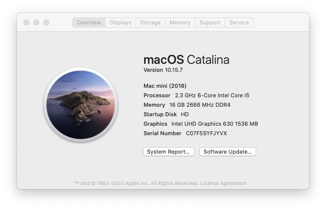
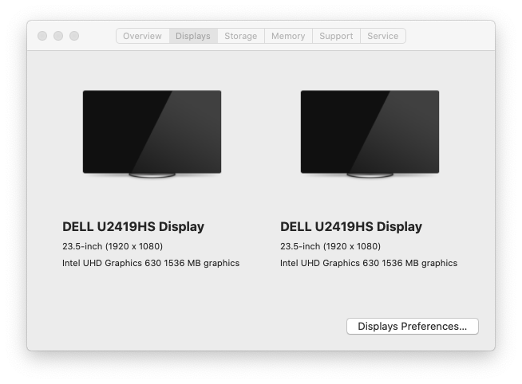
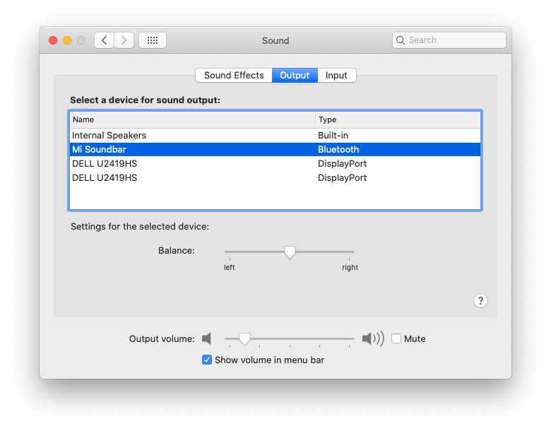
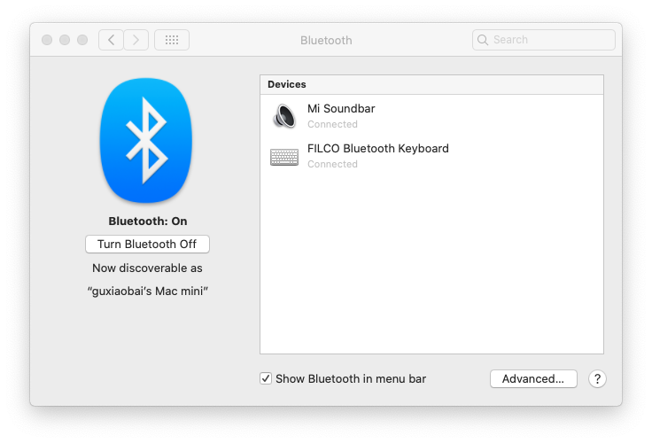

## 7060mff-opencore

### BIOS

**1 - modGRUBShell.efi**

* 修改 DVMT Pre-Allocated 为64MB: `setup_var 0x8DC 0x2`
* 禁用CFG lock: `setup_var 0x5BE 0x0`

### 硬件

* 芯片组: [Intel® Q370 Chipset](https://ark.intel.com/content/www/cn/zh/ark/products/133282/intel-q370-chipset.html)
* 处理器: [英特尔® 酷睿™ i5-8600T 处理器](https://ark.intel.com/content/www/cn/zh/ark/products/129938/intel-core-i5-8600t-processor-9m-cache-up-to-3-70-ghz.html)
* 网络适配器: [英特尔® 以太网连接 I219-LM](https://ark.intel.com/content/www/cn/zh/ark/products/82185/intel-ethernet-connection-i219-lm.html)
* 无线: [英特尔® Wireless-AC 9560](https://ark.intel.com/content/www/cn/zh/ark/products/99446/intel-wireless-ac-9560.html)
* 音频: `Realtek ALC3234`
* 视频: `英特尔 UHD 显卡 630`
* 硬盘: [`WD BLUE SN550 NVME SSD`](https://support-cn.wd.com/app/products/product-detail/p/1555)
* 内存: `三星 DDR4 2666MHz 8GB * 2` / [`M471A1K43DB1-CTD`](https://www.samsung.com/semiconductor/cn/dram/module/M471A1K43DB1-CTD/)
* 显示器: `DELL U2419HS` * 2
* 键盘:  [FILCO Majestouch Minila Air](https://www.diatec.co.jp/en/det.php?prod_c=1470) / [小米无线键鼠套装](https://www.mi.com/buy/detail?product_id=11418)

### Misc

* [x] 有线: 正常
* [x] WiFi: 正常
* [x] 蓝牙
* [x] 声卡
* [x] 显卡

### 效果图

